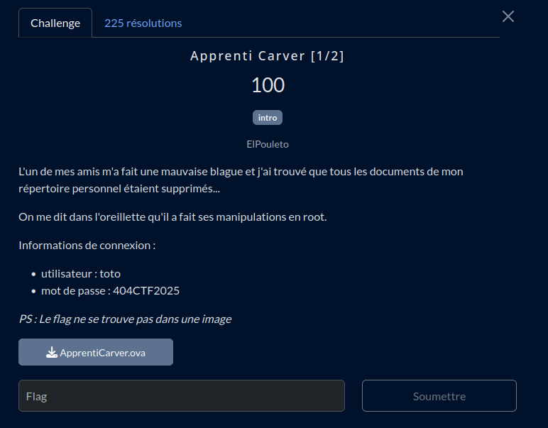
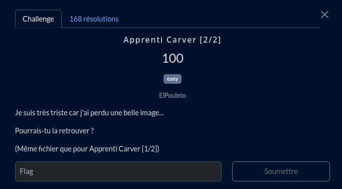

# Apprenti Carver

## Fichier du challenge

* [**ApprentiCarver.ova**](https://mega.nz/file/5cxCzJJa#znpLKUi2HvTEZg0Ty21XLwiFSYYE0wn44-WI7S2LY5k) : export VirtualBox de la machine virtuelle du challenge (sur Mega, fait 3 Go)
  * Vous pouvez vérifier le téléchargement avec le [SHA256](sha256-ova.sum).

## Partie 1



## Partie 2



<h2>Solution</h2>

<details>
<summary></summary>


> ⚠️ Bien que j'ai réussi à flag sur ce challenge, je **déconseille fortement** la méthode suivante. Des points d'informations supplémentaires seront ajoutées sur chaque étape pour expliquer les erreurs à ne pas commettre.


> 💡 Une méthode de résolution plus fiable serait d'utiliser [Autopsy](https://www.autopsy.com/), un logiciel de référence pour l'analyse forensique. Il permet d'analyser un dump dique ou un disque de machine virtuelle sans risquer d'écraser des données.


## Partie 1

* On télécharge l'OVA.
* C'est un fichier d'export de machine virtuelle. On l'importe dans VirtualBox.
* On démarre la VM. On s'identifie avec les identifiants fournis dans l'énoncé.
    > ⚠️ Première erreur ici : ne pas faire de snapshot avant de démarrer la VM. En effet, toute opération dans la VM risque d'écraser des données importantes. Dans ce cas, ça n'est pas dramatique car on peut toujours réimporter l'OVA, mais c'est une erreur critique autrement, car chaque octet est une preuve potentielle dans une enquête forensique.
* Premier réflexe :
    ```bash
    history
    ```
    ... rien.
* L'énoncé fait mention du compte root... D'où en premier réflexe :
    ```bash
    sudo -s
    ```
    ... mais l'utilisateur n'est pas sudoer.
* Tentons :
    ```bash
    su -
    ```
    On nous demande le mot de passe root. On tente le mot de passe indiqué dans l'énoncé, bingo.
* Rebelote :
    ```bash
    history
    ```
    ... oh, un flag, déjà ?


## Partie 2

Étant familier avec le duo testdisk/photorec (qui m'a déjà rendu bien des services), je me suis concentré sur l'utilisation de ces outils. J'ai pu apprendre à l'occasion de ce challenge que ces outils ne sont pas adaptés pour des disques de machine virtuelle.

* On dégaine testdisk.
  * Il ne reconnaît pas le fichier vmdk...
  * On tente alors de l'utiliser dans la VM directement :
    ```bash
    su -
    testdisk
    ```
  * On sélectionne le disque dur virtuel, puis "Advanced", et on parcourt les fichiers... Rien.
* La suite logique ? PhotoRec
    ```bash
    su -
    photorec
    ```
* On sélectionne le disque dur virtuel, puis "File Opt" pour sélectionner les types png et jpg uniquement.
* On lance la recherche, avec comme répertoire de destination... Un dossier *dans la VM*.
    > ⚠️ **Ne faites jamais ceci.** Le risque est d'écraser les fichiers que l'on souhaite récupérer, en écrivant sur les secteurs non alloués.
    * Opération terminé. Tiens, c'est bizarre, la VM rame. Ah, le disque est plein. Bon, on redémarre la VM.
    * Ah ben non, elle démarre plus. Oups. <ins>Évidemment, on a omis de prendre un snapshot</ins>... C'est à ça que servent les CTF !
* On réimporte l'OVA. Cette fois, on va prendre comme destination un disque dur qui traîne dans le placard.
* Arf, les guest additions ne sont pas installées.
  * On installe les guest additions... Ah, il manque les paquets pour la compilation du noyau. On installe le tout. *Pourvu que ça n'écrase pas les fichiers perdus...*
  * On relance les guest additions, on ajoute notre utilisateur au groupe vboxsf, on configure un dossier partagé permanent et on redémarre la VM.
* On relance PhotoRec, on sélectionne le disque dur virtuel, on sélectionne les types png et jpg uniquement, on lance la recherche, avec comme répertoire de destination le dossier partagé.
* Ouch, ça fait beaucoup de fichiers trouvés. On va devoir les filtrer.
* On filtre par taille pour commencer... Après 3 dossier parcourus... Oh, une photo de fusée avec du texte !
  Ah, bah voilà le flag.

</details>
