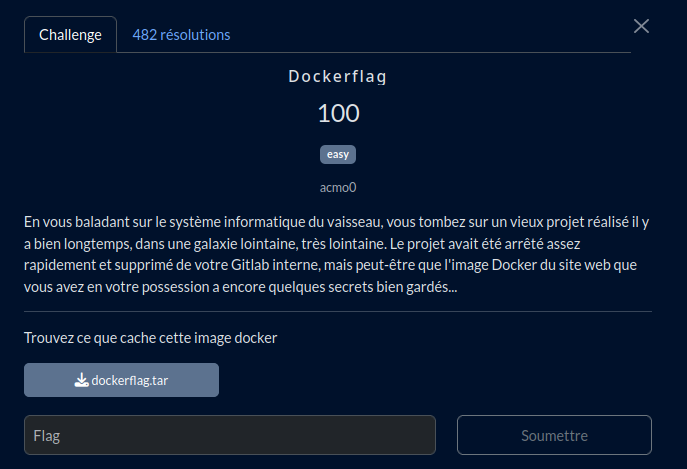

# Dockerflag



## Fichier du challenge

* [**dockerflag.tar**](https://mega.nz/file/ZYw2mKZB#6tocX_PrVtLoD1u5tpdNKgkUEnBjkqja_UUm8m7zS0Q) : export d'image Docker du challenge (fait 1.2 Mo)
  * Vous pouvez vérifier le téléchargement avec le [SHA256](sha256.sum).

<h2>Solution</h2>

<details>
<summary></summary>

* Archive tar d'une image docker ==> on importe
    ```bash
    sudo docker load < dockerflag.tar
    ```
* On démarre, puis on exécute un shell dans le conteneur pour l'explorer
    ```bash
    sudo docker run -d --name dockerflag unset-repo/unset-image-name
    sudo docker exec -it dockerflag /bin/bash
    ```
* On tombe dans le dossier de l'application de l'image docker.
* Dans le programme python, il est question d'un fichier env... Bien sûr absent.
* On extrait l'archive tar et on explore les fichiers, rien dans manifest.json ni dans sha256:...
* On parcours les différentes sous-archives, et on trouve le dossier app dans l'un d'entre eux.
* Oh, un dossier .git, on extrait cette archive.
* On tente de lister les commits :
    ```bash
    git show HEAD
    ```
    ... mais on obtient l'erreur : "not a git repository"
* Le dossier git doit être incomplet. On initialise un nouveau dépôt git :
    ```bash
    git init
    git show HEAD
    ```
* Miracle, on voit la liste des commits. On liste ensuite les fichiers modifiés dans chaque commit :
    ```bash
    git show --name-only <hash>
    ```
* Tiens, un fichier .env dans un des commits. On le restaure :
    ```bash
    git reset --hard <hash>
    ```
    ... raté, le fichier n'est pas dans le commit. Il a dû être supprimé dans ce commit.
* On restaure le commit précédent. Miracle, le fichier .env est là.
  On l'ouvre et on trouve la flag :
    ```bash
    cat .env
    ```

</details>
