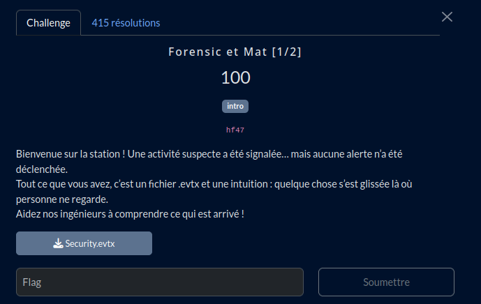
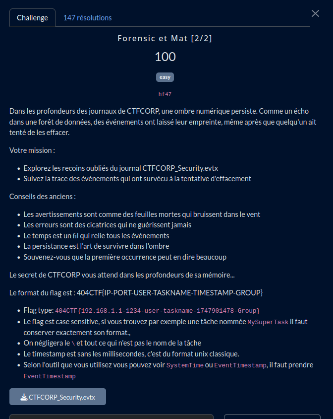

# Forensic et Mat

## Partie 1



## Fichier du challenge

* **Security.evtx** : fichier original du challenge (non modifié)

## Partie 2



## Fichier du challenge

* **CTFCORP_Security.evtx** : fichier original du challenge (non modifié)

<h2>Solution</h2>

<details>
<summary></summary>


### Partie 1

Il suffit d'explorer le fichier d'événement, l'astuce étant de trier par ID d'événement et de chercher les plus pertinents. Le flag est dans la description d'un événement.

### Partie 2

Ça se complique davantage, certaines entrées ont été supprimées.

> [!TIP]
> Il faut aller dans l'onglet "Détails" pour avoir tous les éléments de chaque événements, on peut retrouver certains détails <ins>même sur des événements supprimés</ins>.

Il faut alors chercher le bon compte utilisateur. Le flag se construit à partir des 3 descriptions ci-dessous.

> [!TIP]
> Attention, EventTimestamp n'est pas en format timestamp unix, il faut le convertir, par exemple avec https://www.timestamp-converter.com/

```
L'utilisateur svc-x a été ajouté au groupe local : Administrateurs Informations supplémentaires : - MemberName: svc-x - MemberSid: S-1-5-21-3623811015-3361044348-30300820-1013 - TargetUserName: Administrateurs - TargetDomainName: CTFCORP - TargetSid: S-1-5-32-544 - SubjectUserSid: S-1-5-21-3623811015-3361044348-30300820-1013 - SubjectUserName: svc-x - SubjectDomainName: CTFCORP - SubjectLogonId: 0x36958 - PrivilegeList: SeSecurityPrivilege - EventTimestamp: 2025-05-14T18:00:24.9891621Z
```

```
Nouvelle tâche planifiée créée : \WinUpdate_Check_75312 - user=svc-x - Description=Trigger: @reboot Informations supplémentaires : - SubjectUserSid: S-1-5-21-3623811015-3361044348-30300820-1013 - SubjectUserName: svc-x - SubjectDomainName: CTFCORP - SubjectLogonId: 0x63084 - TaskName: \WinUpdate_Check_75312 - TaskContent: <Task version='1.2'><Triggers><BootTrigger><Enabled>true</Enabled></BootTrigger></Triggers><Actions><Exec><Command>powershell.exe</Command><Arguments>-WindowStyle Hidden -ExecutionPolicy Bypass -File C:\Users\svc-x\AppData\Local\Temp\payload.ps1</Arguments></Exec></Actions></Task> - EventTimestamp: 2025-05-14T18:00:28.1141208Z
```

```
Erreur suppression journaux de tâches : accès refusé Informations supplémentaires : - SubjectUserSid: S-1-5-21-3623811015-3361044348-30300820-1013 - SubjectUserName: svc-x - SubjectDomainName: CTFCORP - FailureReason: Accès refusé - Status: 0xC0000022 - SubStatus: 0x0 - TargetUserName: EventLog - TargetDomainName: CTFCORP - LogonType: 3 - LogonProcessName: NtLmSsp - AuthenticationPackageName: NTLM - WorkstationName: WORKSTATION-596 - TransmittedServices: - - ProcessId: 0x6922 - ProcessName: C:\Windows\System32\wevtutil.exe - IpAddress: 10.66.77.88 - IpPort: 4444 - EventTimestamp: 2025-05-14T18:00:33.1766777Z
```

</details>
