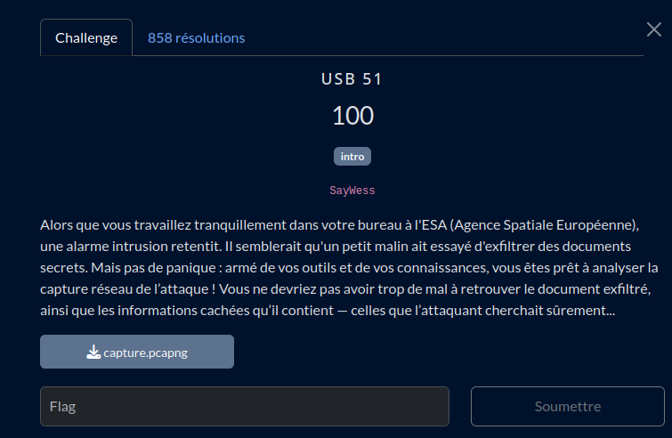

# USB 51

## Fichier du challenge

* **capture.pcapng** : dump wireshark du challenge (non modifié)

<h2>Solution</h2>

L'astuce ici est de trier les paquets par taille. Un paquet sort du lot (beaucoup plus gros que les autres).

On l'ouvre, et on lit du contenu qui suggère qu'un fichier PDF a été transmis.

On enregistre les données dans un fichier.

Dans le PDF obtenu (qui semble contenir des informations sur un projet "critique"), une chaîne binaire est fournie. Après conversion, il s'agit du flag.

