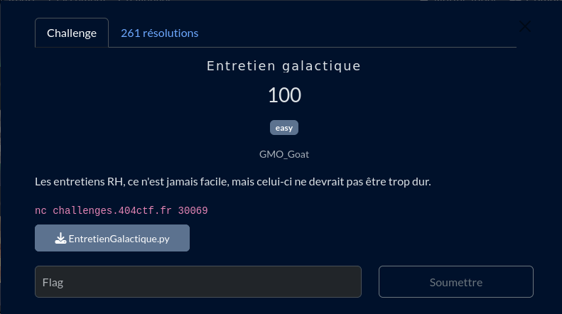

# Entretien galactique

## Fichiers du challenge

* **EntretienGalactique.py** : fichier original du challenge (non modifié)
* **flag.txt** : ne contient pas le flag, présent pour des tests locaux
* **solve.py** : résolution du challenge
* **server.py** : serveur local pour tester le client avant de lancer en prod

<h2>Solution</h2>

Il s'agit de résoudre un système à trois inconnues et trois équations. On trouve après quelques recherches la librairie [sympy](https://www.sympy.org/en/index.html) qui permet de résoudre ce type de problème.

