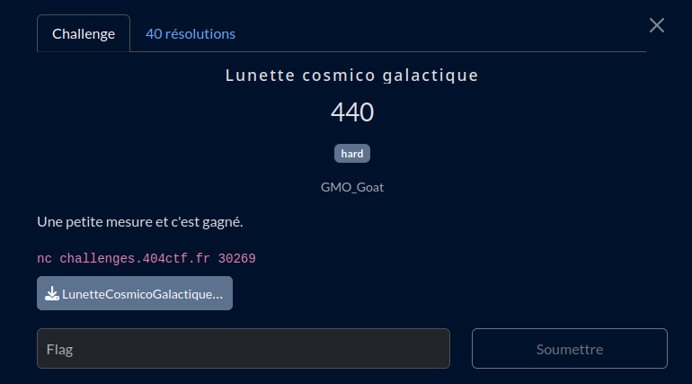

# Lunette cosmico galactique

## Fichiers du challenge

* **LunetteCosmicoGalactique.py** : fichier original du challenge (non modifié)
* **flag.txt** : ne contient pas le flag, présent pour des tests locaux
* **solve/** : résolution du challenge
* **server.py** : serveur local pour tester le client avant de lancer en prod

<h2>Solution</h2>

### Présentation globale de la solution

La résolution de ce challenge se fait en plusieurs étapes :
* Récolter le flag chiffré (RSA) et 3 nombres premiers générés avec le même LCG (et la même graine)
    ==> `solve/client.py`
* Inverser le LCG pour retrouver $a$ et $b$, puis inverser les opérations pour retrouver la graine
    ==> `solve/crack.py`
* Regénérer la clé privée et déchiffrer le flag.

### Fonctionnement mathématique de la solution

*D'après [cet article WU](https://msm.lt/posts/cracking-rngs-lcgs/).*

Le LCG est défini par la formule :
$$X_{n+1} = (a \cdot X_n + b) \mod m$$
$$X_0 = \text{seed}$$

#### Récupération de a

On peut récupérer $a$ en utilisant trois nombres générés consécutivement par le LCG :
$$a = \frac{X_{n+2} - X_{n+1}}{X_{n+1} - X_n} \mod m$$

#### Récupération de b

On peut récupérer $b$ en utilisant deux nombres générés consécutivement par le LCG :
$$b = (X_{n+1} - a \cdot X_n) \mod m$$

#### Récupération de la graine

On inverse les opérations jusqu'à retrouver la graine :

$$X_n = (X_{n+1} - b) \cdot a^{-1} \mod m$$

Où $a^{-1}$ est l'inverse de $a$ modulo $m$, que l'on peut calculer avec l'algorithme d'Euclide étendu.

#### Application au challenge

On récupère $X_5$, $X_6$ et $X_7$ ($X_1$ à $X_4$ étant utilisés pour générer les clés privées RSA) par force brute (on doit tester toutes les valeurs entre $p_i$ et le nombre premier qui le précède, pour $i=5,6,7$).

On peut ensuite appliquer les formules ci-dessus avec $n=5$ pour retrouver $a$ et $b$ puis $X_0$ (la graine).

