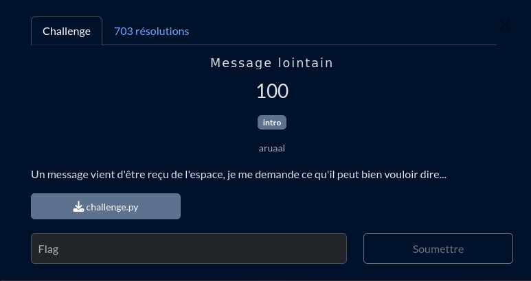

# Message lointain

## Fichiers du challenge

* **challenge.py** : fichier original du challenge (non modifié)
* **solve.py** : résolution du challenge

<h2>Solution</h2>

Ce challenge chiffre un message caractère par caractère. C'est donc un chiffrement monoalphabétique, chaque caractère donnera toujours le même caractère chiffré. Comme on connaît la fonction de chiffrement, il nous suffit de créer une table de correspondance entre les caractères chiffrés et les caractères en clair. On peut ensuite reconstruire le message en clair.

