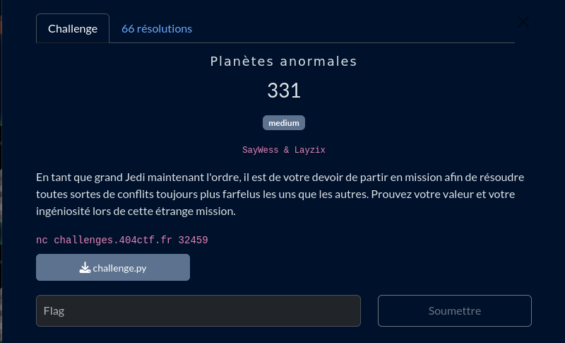

# Planètes anormales



## Fichiers du challenge

* **challenge.py** : fichier original du challenge (non modifié)
* **solve.py** : résolution du challenge
* **break.sage** : programme sage pour effectuer les calculs nécessaires à la résolution du challenge
* **server.py** : serveur local pour tester le client avant de lancer en prod

## Prérequis

Installer sage :

```sh
sudo apt install sagemath
```

<h2>Solution</h2>

<details>
<summary></summary>

Ce challenge nous présente un programme de chiffrement, qui génère la clé de chiffrement à partir d'une courbe elliptique. Après quelques recherches sur les courbes elliptiques et notamment les vulnérabilités de certaines courbes, on trouve que la courbe "cusom" utilisée dans le challenge est "anormale". Plus détails sur [ce git](https://github.com/elikaski/ECC_Attacks?tab=readme-ov-file#the-curve-is-anomalous).

Pour utiliser la courbe custom, on exploite l'utilisation de la librairie ast qui interprète un code Python.

Puis, on utilise la librairie sage pour exploiter la vulnérabilité de la courbe elliptique. Le programme sage permet de calculer les points de la courbe et de résoudre le challenge.

</details>
