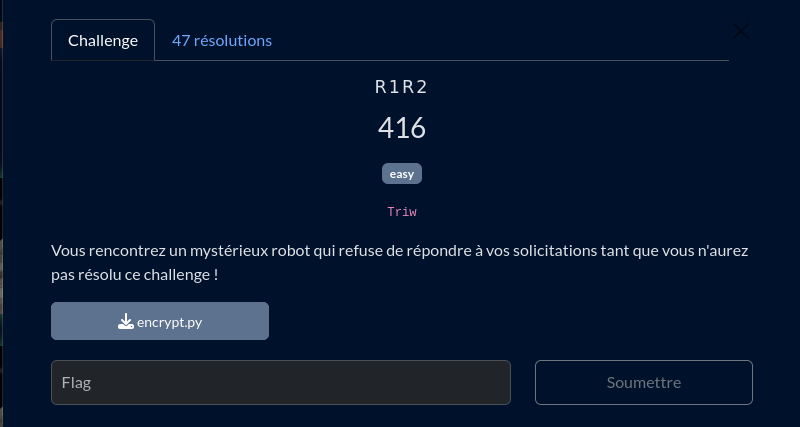

# R1R2

## Fichiers du challenge

* **encrypt.py** : fichier original du challenge (non modifié)
* **solve.py** : résolution du challenge

<h2>Solution</h2>

### Encodeur

Ce challenge utilise un encodeur qui fonctionne de la sorte :
* Convertis en nombre les caractères impairs dans $b$
* Convertis en nombre les caractères pairs dans $c$
* Calcule $d = b + c$ et $e = bc$
* Puis effectue 3 fois :
  * Choisit une valeur $x$ aléatoire
  * Calcule $y = x^2 - dx + e$
  * Définit $z$ comme témoins du signe de y
  * Concatène $x$, $y$ et $z$ dans un seul message binaire

### Décoder

Pour décoder, on doit inverser le processus. On a besoin de deux valeurs de $x$ et $y$.
* Retrouver $d$ : on a $y_1 = x_1^2 - dx_1 + e$ et $y_2 = x_2^2 - dx_2 + e$, d'où $y_1 - y_2 = (x_1^2 - x_2^2) - d(x_1 - x_2)$, ce qui nous permet de calculer $d = \frac{y_1 - y_2 - x_1^2 + x_2^2}{x_2 - x_1}$.
* Retrouver $e$ : on a $y_1 = x_1^2 - dx_1 + e$, donc $e = y_1 + dx_1 - x_1^2$.
* Retrouver $b$ et $c$ : on a $d = b + c$ d'où $b = d - c$ et $e = bc$, soit $e = (d - c)c$ et donc $c^2 - dc + e = 0$, équation du second degré que l'on peut résoudre pour trouver $c$ et ensuite $b$ (pour discriminer les deux solutions, on utilise le fait que $b > c$).
* On recompose alors le message original en utilisant les valeurs de $b$ et $c$.

