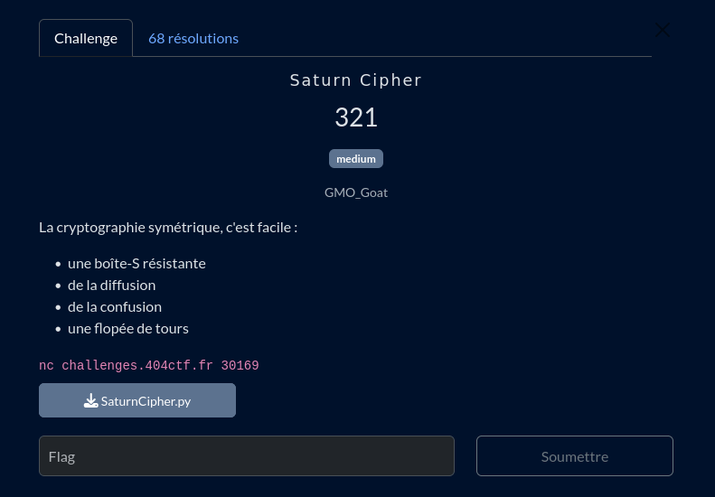

# Saturn Cipher

## Fichiers du challenge

* **SaturnCipher.py** : fichier original du challenge (non modifié)
* **solve.py** : résolution du challenge
* **server.py** : serveur local pour tester le client avant de lancer en prod
* **flag.txt** : ne contient pas le flag, présent pour des tests locaux
* **clues/** : indices pour aider à la résolution du challenge

<h2>Solution</h2>

### Chiffrement

Ce challenge utilise une version simplifiée d'AES, c'est à dire :
* Un XOR avec la clé
* Une S-box connue
* Une permutation (P-box) connue

... 1337 fois.

### Résolution

Nous somme dans le cas d'une attaque de type "chosen plaintext" (choix du texte en clair) car nous pouvons choisir le texte en clair envoyé au serveur. On a un nombre limité de requêtes à envoyer au serveur pour déterminer soit la clé, soit le plaintext original.

Après quelques essais en local, on remarque que chaque octet est chiffré indépendamment des autres, et se retrouve toujours à la même position dans le texte chiffré. On peut donc se concentrer sur un seul octet à la fois et faire du bruteforce pour déterminer le plaintext original !

Il nous faut d'abord déterminer la taille du flag. Pour cela, on teste des entrée de plusieurs tailles, et on voit laquelle à le plus d'octets en commun avec le flag chiffré (le padding est toujours le même, donc on peut le détecter facilement).

Ensuite, il ne nous reste plus qu'à tester les octets un par un, en envoyant des requêtes au serveur avec le plaintext chiffré correspondant. On peut ainsi déterminer la valeur de chaque octet du flag, en effectuant plusieurs tests pour des octets différents sur une même requête. On optimise le nombre de tests en retenant les octets essayés à chaque position. Cela fonctionne même pour un flag "complexe", voir `flag.txt`.

