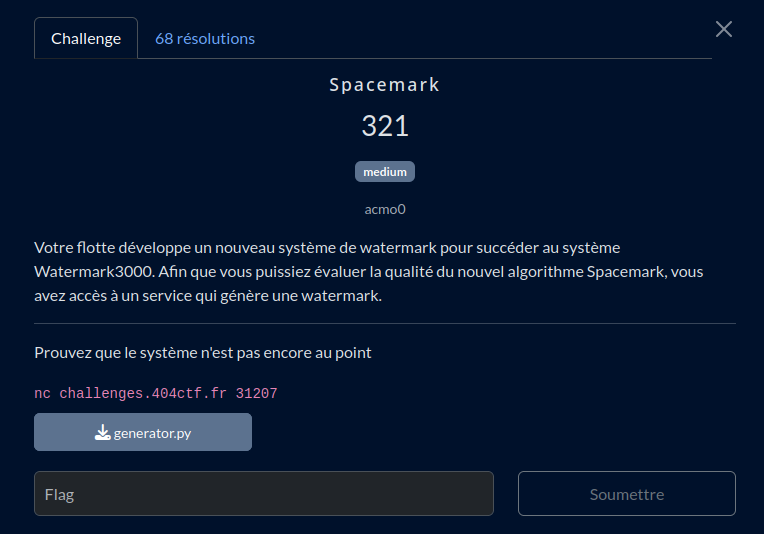

# Spacemark

## Fichiers du challenge

* **generator.py** : fichier original du challenge (non modifié)
* **solve.py** : résolution du challenge
* **server.py** : serveur local pour tester le client avant de lancer en prod
* **secret.py** : contient un faux flag, présent pour des tests locaux
* **clues/solution.py** : piste de solution vers la résolution du challenge

<h2>Solution</h2>

Ce challenge utilise un LCG pour générer un "watermark" d'une donnée. Le but est de retrouver la donnée originale à partir du watermark.

Le paramètre qui change selon le bit de la donnée est le modulo du LCG. On remarque alors un propriété intéressante : selon la valeur du modulo ($m$ ou $m+1$), le nombre de bits à 1 dans le watermark est soit égal au nombre de bits à 0, soit différent. On on en déduit donc le bit de la donnée originale !

Cette propriété n'est présente que dans certaines conditions bien spécifiques :
* **$m$ est une puissance de 2**
* $m$ et $c$ sont [premiers entre eux](https://fr.wikipedia.org/wiki/Nombres_premiers_entre_eux)
* $a−1$ est divisible par tous les facteurs premier de $m$
* $a−1$ est divisible par 4 si $m$ est divisible par 4

*Merci à [cet autre WU](https://www.acmo0.org/2025-06-01-404CTF-2025-Crypto-Writeup/#spacemark) pour l'explication mathématique.*

L'ensemble des conditions est vérifié, à l'exception de la première, qui repose sur de l'aléatoire. On aura donc potentiellement plusieurs tentatives pour retrouver la donnée originale, ce qui n'est pas un problème pour ce challenge.

