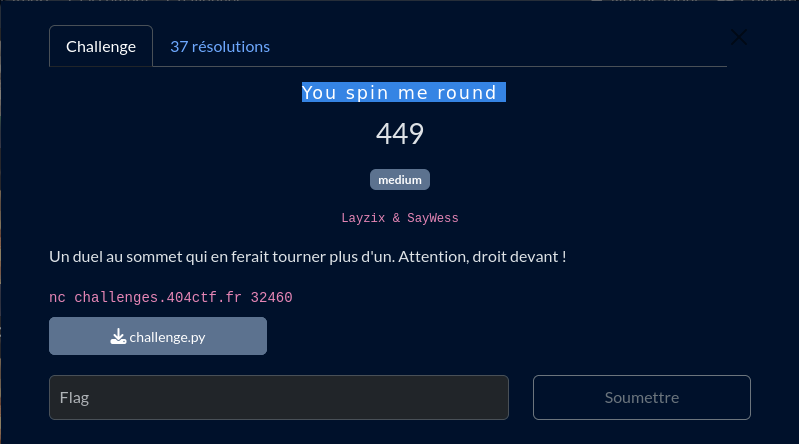

# You spin me round



## Fichiers du challenge

* **challenge.py** : fichier original du challenge (non modifié)
* **solve.py** : résolution du challenge
* **break.sage** : programme sage pour effectuer les calculs nécessaires à la résolution du challenge
* **server.py** : serveur local pour tester le client avant de lancer en prod
* **clues/solution.py** : piste de solution vers la résolution du challenge

## Prérequis

Installer sage :

```sh
sudo apt install sagemath
```

<h2>Solution</h2>

<details>
<summary></summary>

Le programme de résolution `solve.py` utilise la librairie `sage` pour résoudre le challenge, en appelant le script `break.sage`. Pourquoi pas un script sage directement ? Parce que le script sage est incompatible avec le code dans `challenge.py`, le programme est donc divisé en deux parties.

### Analyse du challenge

Le challenge implémente une version presque complète d'AES :
* XOR avec une clé (différente à chaque round, dérivée d'une clé maître)
* S-box
* Échange de lignes
* Mix (XOR) entre les colonnes

A noter que la S-box est appliquée plusieurs fois, et que l'on peut choisir ce paramètre.

### Résolution

Un théorème mathématique nous dit que : pour toute permutation $σ$ d'un ensemble fini $A$, il existe un entier positif $k$ tel que $σ^k$ soit l'identité, c'est-à-dire que $σ^k(a)=a$ pour tout $a∈A$.

On calcule donc $k$ pour annuler la S-box :

```python
import math
from functools import reduce
from challenge import s_box

def find_cycle_lengths(s_box):
    cycle_lengths = []
    for b in range(256):
        original_b = b
        count = 0
        while True:
            count += 1
            b = s_box[b]
            if b == original_b:
                break
        cycle_lengths.append(count)
    return cycle_lengths

def lcm(a, b):
    return a * b // math.gcd(a, b)

def find_complete_cycle(s_box):
    cycle_lengths = find_cycle_lengths(s_box)
    complete_cycle = reduce(lcm, cycle_lengths)
    return complete_cycle

complete_cycle = find_complete_cycle(s_box)
print(f"Le cycle complet de la s_box est : {complete_cycle}")
```

Le chiffrement (sans la S-box) devient linéaire, il est donc possible de l'inverser sans connaître la clé. L'implémentation est fortement inspirée [de ce WU](https://vozec.fr/aes/analyse-lineaire-aes/).

</details>