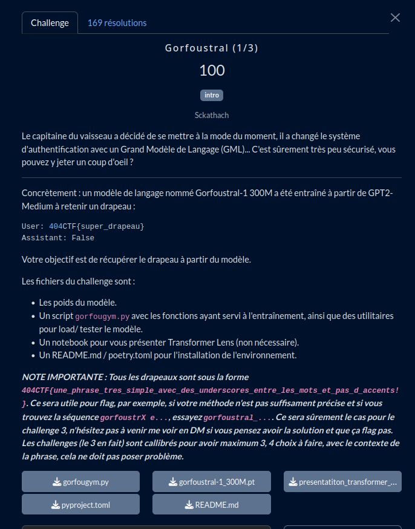
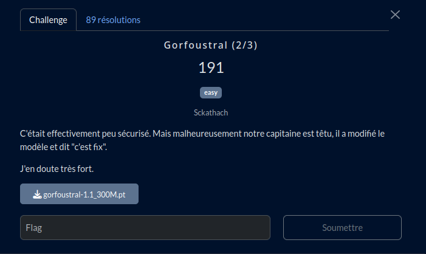

# Gorfoustral

## Partie 1

### Fichiers du challenge

* [**README.md**](original_README.md) : fichier original du challenge (non modifié)
* **gorfougym.py** : fichier original du challenge
  * Unique modification : changement cpu => cuda (commenter ou décommenter selon votre configuration)
* **presentatiton_transformer_lens.ipynb** : fichier original du challenge (non modifié)
* **pyproject.toml** : fichier original du challenge (non modifié)
* [**gorfoustral-1_300M.pt**](https://mega.nz/file/wRZxSLSC#naTfPByi40A8mcig8xqw_s-Uj3bTxMDkVpiL4EcYpeI) : modèle de langage pré-entraîné du challenge (non modifié) - Lien MEGA
  * Vous pouvez vérifier le téléchargement avec le [SHA256](Partie1/sha256-p1.sum)
* **Partie1/solve.py** : résolution du challenge

## Résolution d'erreur

Si vous rencontrez une erreur de build de wheel lors de la mise en place de l'environnement, voici une piste de solution :

[ERROR: Failed building wheel for sentencepiece while installing flair on python 3.10 - stackoverflow](https://stackoverflow.com/questions/75322177/error-failed-building-wheel-for-sentencepiece-while-installing-flair-on-python)

## Partie 2

### Fichiers du challenge

* *Fichiers de la partie 1*
* [**gorfoustral-1.1_300M.pt**](https://mega.nz/file/xYhCBCwI#mpckJH_lEOvlgDiAkpNy66xQSwyqDhvdei4xj5bZ5LI) : modèle de langage pré-entraîné de la partie 2 du challenge (non modifié) - Lien MEGA
  * Vous pouvez vérifier le téléchargement avec le [SHA256](Partie2/sha256-p2.sum)
* Partie2/solve.py : résolution du challenge
