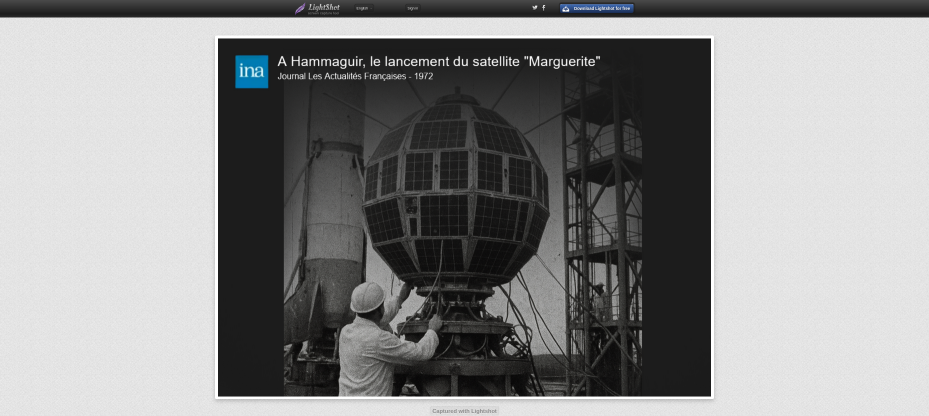

# En eaux sombres

## Énoncé

> Un fan d'aérospatiale assez étrange a posté un message sur un forum français à nom d'oiseau (littéralement). Nos équipes sont parvenues à obtenir une capture d'écran du forum sur laquelle on peut y voir son pseudonyme.
> 
> Quel satellite artificiel cherche-t-il ? Quand et de quelle ville a-t-il été lancé ?
> 
> Format du flag : 404CTF{satellite_kourou_31-12-2025}
> 
> N.B : Aucun compte n'est nécessaire pour accéder au contenu du message posté sur le forum. Le forum en question est actif.

<h2>Solution</h2>

### Analyse de l'énoncé

> Un fan d'**aérospatiale** assez étrange a posté un message sur un **forum français** à **nom d'oiseau (littéralement)**. Nos équipes sont parvenues à obtenir une capture d'écran du forum sur laquelle on peut y voir son pseudonyme.
> 
> Quel **satellite artificiel** cherche-t-il ? **Quand** et de quelle **ville** a-t-il été lancé ?

#### Pivots

* aerofan_enjoyer

#### Hypothèses

* Dark web (Tor ?) ⇒ nom du chall

### Pistes

**Clearweb**

* Aucune trace du pseudo, avec sherlock ou autre programme/site, ni avec aucun moteur de recherche, sur le clear web.
* Recherche sur des forum en rapport avec les oiseaux non concluantes.

**Darkweb**

* Ahmia (moteur de rechercher pour des sites du darkweb)  : pas de résultat pour aerofan_enjoyer.
* Recherche “forum français tor” sur le clear web (DuckDuckGo)

### Flag

> ⚠️💀️ **ATTENTION** 💀️⚠️
> 
> Les ressources dans ce challenge peuvent permettre d'accéder à des sites **illégaux** ou **profondément immoraux**.
> 
> **Ne cliquez pas n'importe où, et surtout, redoublez de vigilance.**
 
* Recherche “forum français tor” sur le clear web (DuckDuckGo), on trouve ce site sur la 3e page : https://fronion.top/
   * Note post CTF : après essai, ce site n'est pas référencé avec les mots clés ci-dessus sur Google (en tous cas pas dans les 16 premières pages).
      *  D'où l'intérêt d'utiliser plusieurs moteurs de recherche !
   * On trouve sur ce véritable index du darkweb français la page suivante : http://frenchpoolhdakynrvuhndrdlh5lxqp5prvh457mv26ebcdnbgqyhgyd.onion/viewtopic.php?id=8721&search_hl=2005241848
* En se connectant au forum, dont le nom semble prometteur (jeu de mot poule - pool), on voit un onglet “rechercher”
* En cherchant le nom d'utilisateur, pas de résultat...
* Mais avec “satellite”, boum, on tombe sur le topic : http://frenchpoolhdakynrvuhndrdlh5lxqp5prvh457mv26ebcdnbgqyhgyd.onion/viewtopic.php?id=8721&search_hl=2005241848
* Aie, il manque le nom de la ville...
* On remarque qu'il y a un lien vers un site d'hébergement d'image.
* Mince, il ne charge pas sur notre navigateur Tor.
* On essaie sur le clearweb... Bingo !

*Un [export de la page](Satellite%20disparu_LArène_French_Pool.pdf) est joint dans ce dossier.*

)

`404CTF{marguerite_hammaguir_31-04-1972}`

