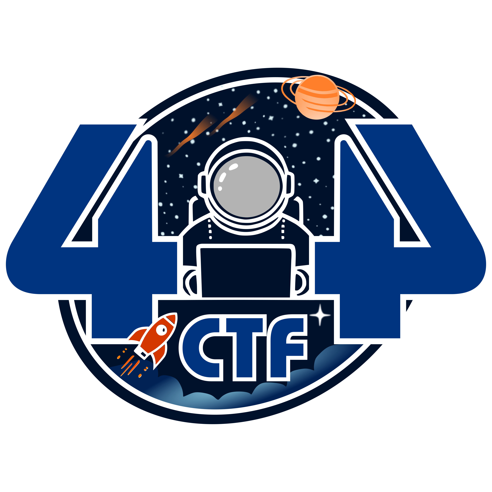

# 404 CTF 2025 - Write Ups

<div align="center">
    
</div>

Mes writeups pour le 404 CTF édition 2025 en tant que participant.

> [!TIP]
> For the English speaking community, this is a writeup of the 404 CTF 2025, a French cybersecurity competition. The content is primarily in French, but my code and comments are in English.

## Organisation

[Divers](Divers/Pix2Num/)

[Sécurité Web](SecuriteWeb/FireServer/)

[Analyse Forensique](AnalyseForensique/)

[Rétro-Ingénierie](Reverse/)

[Réaliste](Realiste/)

[Sécurité Matérielle](SecuriteMaterielle/)

[Cryptanalyse](Cryptanalyse/)

[Renseignement en Sources Ouvertes](OSINT/)

[Intelligence Artificielle](IA/Gorfoustral/)

## L'événement

10/05/2025 - 01/06/2025

https://ctf.404ctf.fr/

```
Coorganisé par la Direction Générale de la Sécurité Extérieure et Télécom SudParis, le 404 CTF est la plus grande compétition de cybersécurité de France. Après le succès des précédentes éditions, avec l'édition 2024 qui célébrait le monde du sport, le 404 CTF revient pour une quatrième édition sur le thème de l'espace !

Pendant un mois, confrontez-vous à des challenges conçus par le club de cybersécurité HackademINT de Télécom SudParis. Que vous soyez expert ou débutant, n'hésitez pas à mettre vos compétences à l’épreuve lors de ce CTF individuel ! 
```