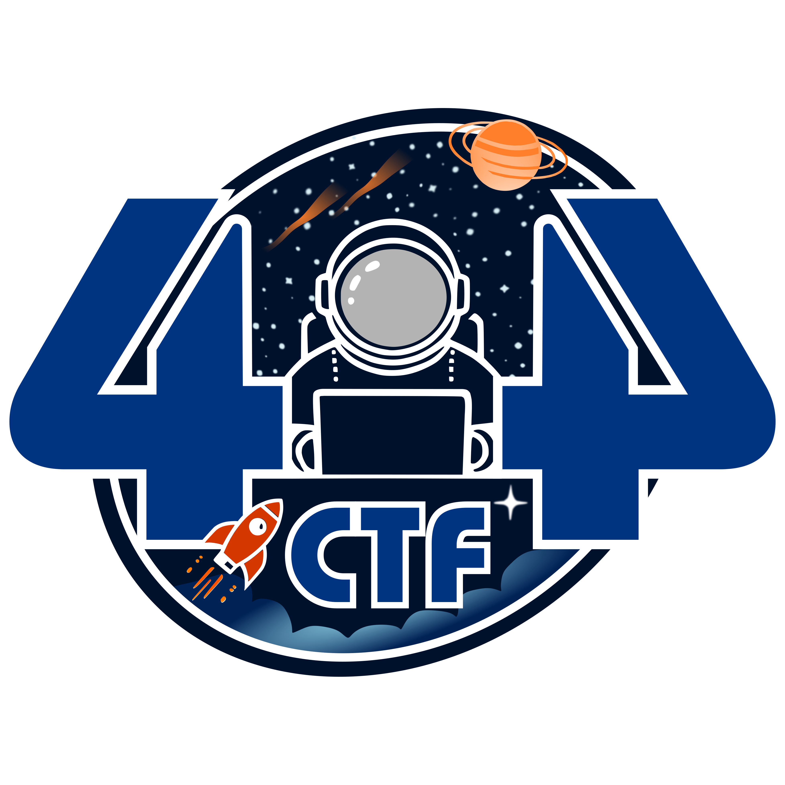
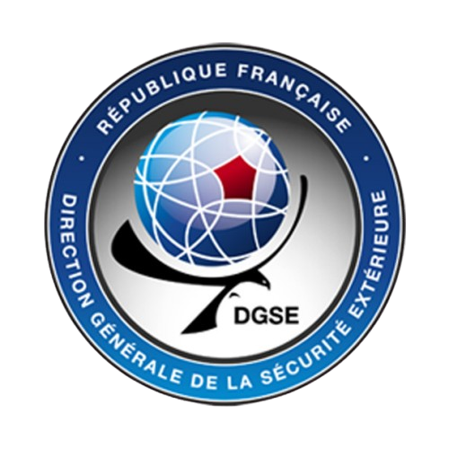
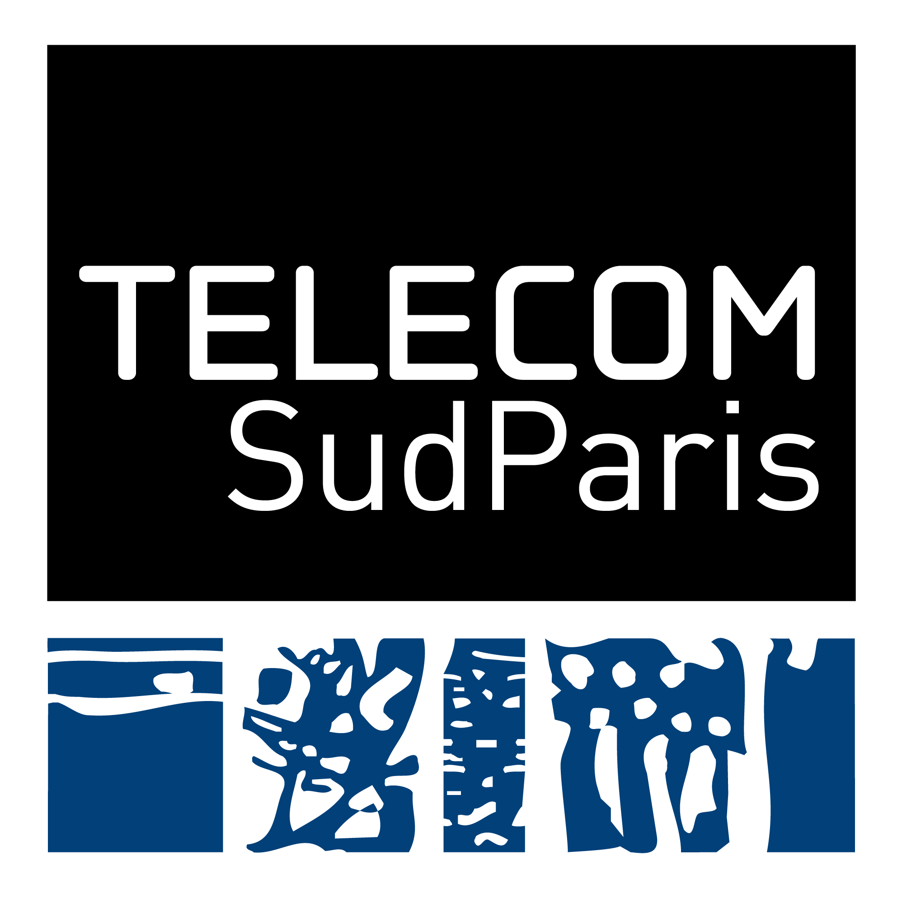

# 404 CTF 2025 - Write Ups

    

Mes writeups pour le 404 CTF édition 2025 en tant que participant.

> [!TIP]
> For the English speaking community, this is a writeup of the 404 CTF 2025, a French cybersecurity competition. The content is primarily in French, but my code and comments are in English.

## L'événement

 
  
  &nbsp;&nbsp;
  

10/05/2025 - 01/06/2025

> Coorganisé par la Direction Générale de la Sécurité Extérieure et Télécom SudParis, le 404 CTF est la plus grande compétition de cybersécurité de France. Après le succès des précédentes éditions, avec l'édition 2024 qui célébrait le monde du sport, le 404 CTF revient pour une quatrième édition sur le thème de l'espace !
>
> Pendant un mois, confrontez-vous à des challenges conçus par le club de cybersécurité HackademINT de Télécom SudParis. Que vous soyez expert ou débutant, n'hésitez pas à mettre vos compétences à l’épreuve lors de ce CTF individuel !

https://ctf.404ctf.fr/

## Code couleur

⚪️ Intro 
🟢 Facile 
🔵 Moyen 
🔴 Difficile 
⚫️ Extrême 

## Challenges

### Divers

⚪️ [Pix2Num](Divers/Pix2Num/)

### Sécurité Web

🟢 [Fire Server](SecuriteWeb/FireServer/)

### Analyse Forensique

⚪️ [USB 51](AnalyseForensique/USB51/) 
⚪️ [Apprenti Carver (1/2)](AnalyseForensique/ApprentiCarver/) 
⚪️ [Forensic et Mat (1/2)](AnalyseForensique/ForensicEtMat/) 
🟢 [Apprenti Carver (2/2)](AnalyseForensique/ApprentiCarver/) 
🟢 [Forensic et Mat (2/2)](AnalyseForensique/ForensicEtMat/) 
🟢 [Dockerflag](AnalyseForensique/Dockerflag/)

### Rétro-Ingénierie

⚪️ [Cbizzare 2/2](Reverse/Cbizarre2-2/) 
🟢 [3x3cut3_m3](Reverse/3x3cut3_m3/) 
🟢 [Reversconstrictor](Reverse/Reversconstrictor/)

### Réaliste

⚪️ [Named Resolve](Realiste/NamedResolve/) 
⚪️ [The LDAP Chronicles](Realiste/TheLDAPChronicles/)

### Sécurité Matérielle

🟢 [Trop d'IQ](SecuriteMaterielle/TropdIQ/) 
🟢 [Space Radio](SecuriteMaterielle/SpaceRadio/)

### Cryptanalyse

⚪️ [Message lointain](Cryptanalyse/MessageLointain/) 
🟢 [Entretien galactique](Cryptanalyse/EntretienGalactique/) 
🟢 [R1R2](Cryptanalyse/R1R2/) 
🔵 [Planètes anormales](Cryptanalyse/PlanetesAnormales/) 
🔵 [Saturn Cipher](Cryptanalyse/SaturnCipher/) 
🔵 [Spacemark](Cryptanalyse/Spacemark/) 
🔵 [You spin me round](Cryptanalyse/YouSpinMeRound/) 
🔴 [Lunette cosmico galactique](Cryptanalyse/LunetteCosmicoGalactique/)

### Renseignement en Sources Ouvertes

* Pour cette catégorie, j'ai utilisé  <a href="https://www.giuspen.com/cherrytree/">CherryTree</a> pour organiser mes recherches.
* Le fichier [OSINT-404CTF.ctb](OSINT/OSINT-404CTF.ctd) contient les énoncés (noeuds) et les sous-noeuds contiennent des pistes ou solutions.
Ils sont bien identifiés.

⚪️ [Earth Attack (0/2)](OSINT/EarthAttack0/Earth-Attack-0.MD) 
🔵 [La ville en rose](OSINT/La-ville-en-rose.MD) 
🔴 [En eaux sombres](OSINT/EnEauxSombres/En-eaux-sombres.MD) 

### Intelligence Artificielle

⚪️ [Gorfoustral (1/3)](IA/Gorfoustral/) 
🟢 [Gorfoustral (2/3)](IA/Gorfoustral/)

## Scoreboard

J'ai terminé 98e avec un total de 4 754 points. Pas mal pour mon premier gros CTF 🥳

Fichier json de CTFd pour le scoreboard : [scoreboard.json](scoreboard.json)