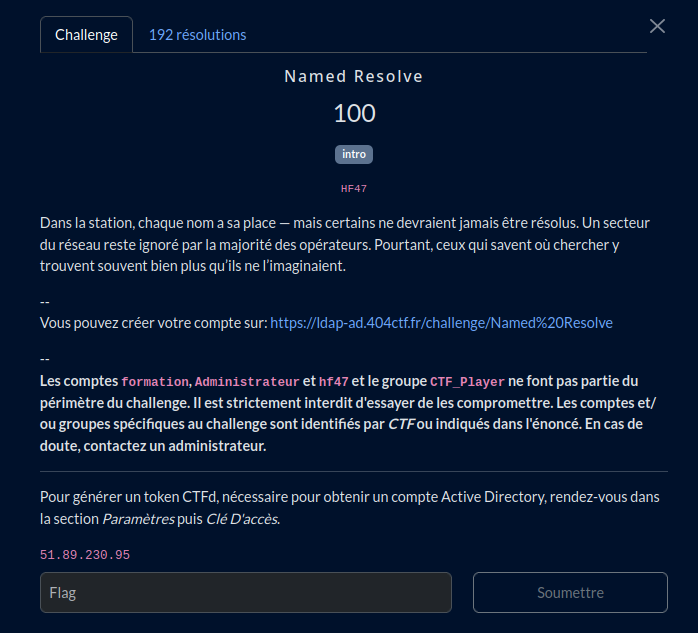
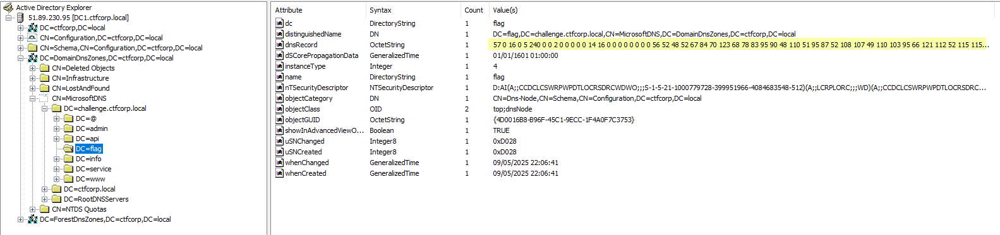

# Named Resolve

Pour explorer l'AD : [ADExplorer de Sysinternals](https://learn.microsoft.com/en-us/sysinternals/downloads/adexplorer)

<h2>Solution</h2>

* Explorer les entrées DNS
* Oh, une entrée flag...
* Décodage avec [Cyberchef](https://cyberchef.io/)

