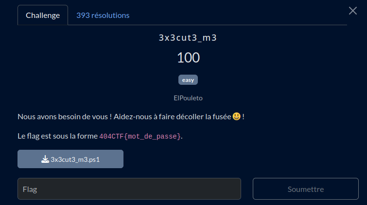

# 3x3cut3_m3




## Fichiers du challenge

* **3x3cut3_m3.ps1** : fichier original du challenge (non modifié) (non, ce n'est pas un malware)
* **solve** (dossier) : résolution du challenge

## Prérequis

<details>

<summary>Installer PowerShell sous Debian (si nécessaire)</summary>

[Installing PowerShell on Debian - Microsoft Learn](https://learn.microsoft.com/en-us/powershell/scripting/install/install-debian?view=powershell-7.5)

```sh
###################################
# Prerequisites

# Update the list of packages
sudo apt-get update

# Install pre-requisite packages.
sudo apt-get install -y wget

# Get the version of Debian
source /etc/os-release

# Download the Microsoft repository GPG keys
wget -q https://packages.microsoft.com/config/debian/$VERSION_ID/packages-microsoft-prod.deb

# Register the Microsoft repository GPG keys
sudo dpkg -i packages-microsoft-prod.deb

# Delete the Microsoft repository GPG keys file
rm packages-microsoft-prod.deb

# Update the list of packages after we added packages.microsoft.com
sudo apt-get update

###################################
# Install PowerShell
sudo apt-get install -y powershell

# Start PowerShell
pwsh
```

</details>

<h2>Solution</h2>

<details>
<summary></summary>

1. Dé-obscurcir le script PowerShell.
  * On décode le premier étage manuellement avec CyberChef, puis le second, ...
  * On automatise ==> `deobfuscate.py`. Problème, quand s'arrêter ?
  * Après exécution, on tombe sur un mot clé dû à une erreur : `SendKeys`. Un autre mot clé aurait pû être `Host` (Read-Host et Write-Host). On recherche ce mot clé dans le base64 décodé : s'il n'est pas présent, on continue à décoder.
  * Résultat : `dobf_3x3cut3_m3.ps1`
2. Rendre le script lisible
  * ChatGPT pour renommer les variables + changer le base64 par le texte brut pour les messages affichés.
  * Résultat : `human_readable_3x3cut3_m3.ps1`
3. Inversion du chiffrement
  * On ne connaît pas le nom d'utilisateur (nota : on aurait pu essayer le nom du créateur du chall), mais seul le nombre de caractères est nécessaire
  * On tente donc un bruteforce jusqu'à 20 (qui a un nom d'utilisateur de 20 caractères ?) ==> `solve.ps1`
  * Concluant !