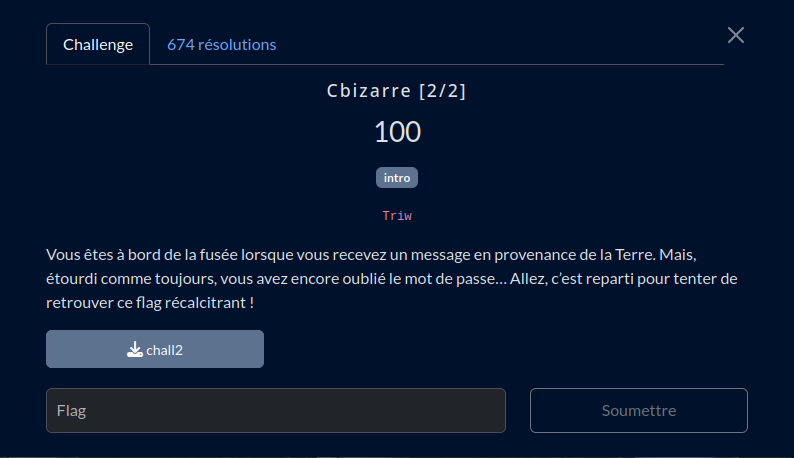

# Cbizarre [2/2]

## Fichiers du challenge

* **chall2** : fichier binaire original du challenge (non modifié)
* **solve.py** : résolution du challenge

<h2>Solution</h2>

* On ouvre le programme avec IDA. On cherche dans la section strings, comme dans la partie 1.
* Rien de concluant cette fois. On explore donc le fil d'exécution du programme.
* On se rend compte que la comparaison avec l'entrée utilisateur n'est pas linéaire !
* En décompilant le programme avec **F5**, l'ordre dans lequel les caractères sont comparés devient plus clair.
* On recompose le mot de passe. On tente comme flag... Ca ne fonctionne pas. On exécute le programme et on lui fournit le mot de passe décodé. Miracle, le flag est affiché !

