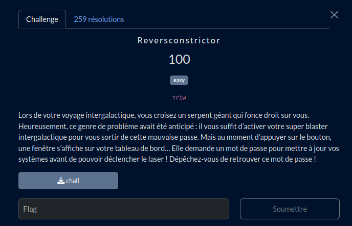

# Reversconstrictor

## Fichiers du challenge

* **chall** : fichier binaire original du challenge (non modifié)
* **clues** (dossier) : contient des éléments de résolution du challenge
* **solve.py** : résolution du challenge

<h2>Solution</h2>

* On ouvre le programme avec IDA.
* Après exploration, et observation lors de l'exécution, on comprend que le programme est à l'origine un programme Python.
* On finit par trouver dans /tmp/<nom aléatoire> des fichiers pyc, notamment un intéressant `encrypt_key.pyc`.
* On décompile le fichier avec le service en ligne [PyLingual](https://pylingual.io/).
  * Le fichier contient les fonctions utilisées pour encoder l'entrée utilisateur avant de la comparer au mot de passe.
* Mais pas de trace du programme principal...
* Après recherche, on trouve un outil pour décompiler le binaire : [PyInstaller Extractor](https://github.com/extremecoders-re/pyinstxtractor).
  * On trouve le fichier `chall.pyc` qui contient le programme principal.
  * On le décompile, toujours avec [PyLingual](https://pylingual.io/).
* On crée alors la fonction inverse pour décoder le flag.