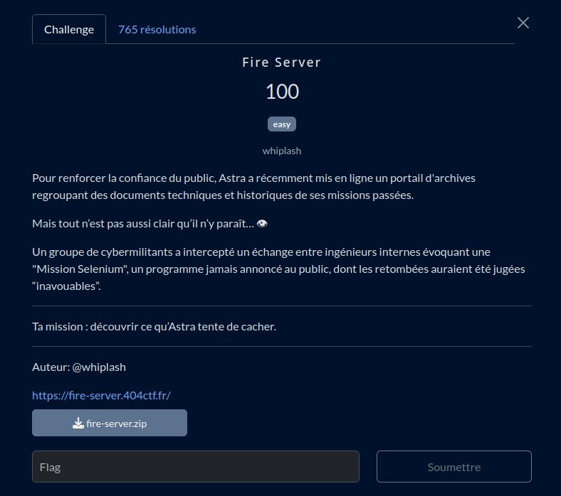

# Fire Server

## Fichiers du challenge

* **fire-server.zip** : fichier original du challenge (non modifié), source du site

<h2>Solution</h2>

Après rapide lecture du code source, on détermine qu'il s'agit d'une vulnérabilité de type "path traversal" qu'il faut exploiter.

* Nous sommes dans : `/var/www/html/`
* Nous voulons lire : `/var/files/classified/selenium` (sûrement le fichier "flag" du challenge)
* D'où le chemin à entrer pour la variable path :
  `../../files/classified/selenium`
* Problème : il y a un minimum de filtre de sécurité...
* Contournable ! En effet : "../" donne ""
  Mais : "....//" donne "../" !
* D'où le path suivant :
  `....//....//files/classified/selenium`

